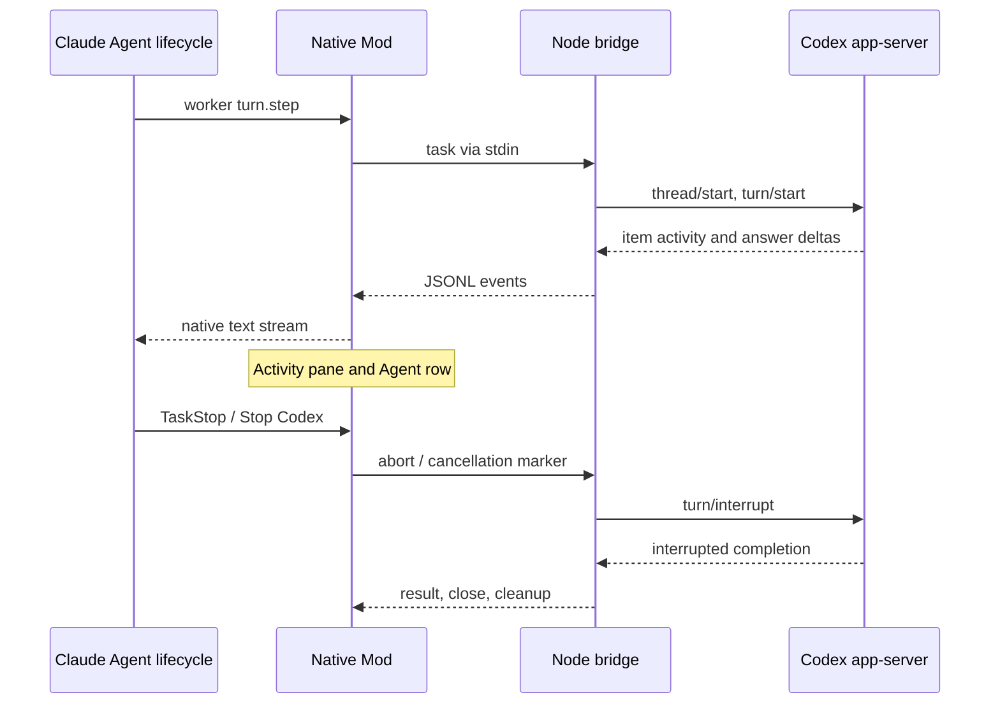

# Native Codex subagent prototype

Claude owns the subagent lifecycle; the real Codex harness executes its task. This separate Mod addresses the official plugin's opaque background jobs with native Agent identity, streamed answers, a live activity pane, and cancellation. It is experimental and read-only.

## Try it

Tested with Claude Code **2.1.289**, Codex **0.160.0**, and Node **24.16.0**. Both CLIs must be installed and authenticated. Run from this repository:

```bash
npm ci
npm run prototype
```

This loads the Mod for that Claude session without installing it globally. Start a background agent with:

```text
/codex-native Read README.md and explain the architecture in one paragraph.
```

Use `/codex-native-status` to open its activity pane. The pane shows the actual Codex model, Claude agent ID, Codex thread ID, commands, command output, tool activity, and state. It retains the last 100 activity events per run and displays the last 20 events for up to eight runs. Use **Stop Codex**, `/codex-native-stop <agent-id>`, or Claude's native task controls to interrupt it.

Claude can also delegate through its ordinary Agent tool. Ask:

```text
Use the codex-native-prototype:worker agent to review the bridge read-only.
Run it in the foreground and summarize its findings.
```

Claude chooses delegation in this path, so the parent uses Claude inference as usual. Only the designated worker's model step is replaced by Codex. Ordinary Claude agents pass through unchanged.

## How it works



The bridge starts one isolated app-server per task, sets `sandbox: read-only` and `approvalPolicy: never`, and inherits your Codex model configuration. It waits for Codex's actual completion before reporting success. A failed bridge returns a visible error; a repeated worker model step reuses its result rather than executing the task again. The existing official plugin's shared broker is untouched.

## Validation

Claude generates its version-matched Mod API types when it first loads this plugin. Then:

```bash
npm run prototype:validate
npm run prototype:test
npm run prototype:acceptance
npm test
```

`prototype:test` checks the app-server protocol and uses Claude's actual Mod test engine to exercise streaming, errors, terminal and desktop render trees, and the Stop button. `prototype:acceptance` drives real Claude Agent and TaskStop tools with a **simulated Codex server**, with no model requests. Its report distinguishes this from real-provider evidence.

An optional real-provider run sends the delegated repository task to your configured Codex provider and uses Codex usage:

```bash
npm run prototype:acceptance -- --real
```

The test-only driver scripts parent responses, so acceptance checks can require zero Claude model calls while still invoking real Agent tools. It is never loaded by `npm run prototype`. The runner verifies one native agent, foreground completion, TaskStop abortion, and no surviving app-server process. [Acceptance evidence](ACCEPTANCE.md) records the observed results and limitations.

## Prototype limits

- Tasks cannot edit files or request approval. Connected tasks have a two-minute limit. Connection bootstrap inherits the upstream client's behavior and does not yet have its own deadline.
- Session restart does not resume Codex tasks. State lives in the Mod session.
- Terminal and Claude desktop support the activity UI; headless mode has streamed text and native task lifecycle but no pane. The VS Code panel is outside this prototype's UI scope.
- Codex's internal tools do not become Claude tool calls: Claude's tool count can be zero even while the pane shows Codex commands. Nested Codex thread events are labeled, but there is no complete nested-agent tree.
- Claude records the worker as completed when it returns a visible failure message; the pane carries the underlying Codex failed state.
- Render trees and button behavior are tested using Claude's UI kit. Pixel layout and keyboard behavior still need an interactive terminal/desktop acceptance pass.
- The bridge imports the existing official plugin's app-server client from the sibling directory. Keep this repository layout; this is not yet a standalone distributable plugin.

The next step after evaluating this prototype is to extract a stable transport boundary, add explicit permission mapping for editing tasks, and validate interactive task navigation before publishing a replacement.

References: [Claude Mods](https://code.claude.com/docs/en/plugins/mods/overview), [Mod API](https://code.claude.com/docs/en/plugins/mods/api), [Codex app-server](https://learn.chatgpt.com/docs/app-server).
